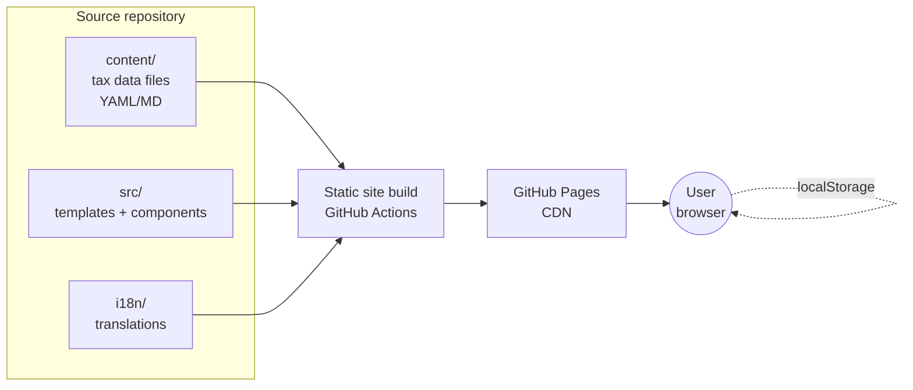

# Architecture

## One-line summary

A static, multilingual website built from structured tax-data files, deployed to GitHub Pages, with no backend.

## Goals

- **Frictionless for users** — fast page loads, no JS required to read content, works on a low-end phone.
- **Maintainable** — adding/updating a tax should be editing one file in one place.
- **Auditable** — every piece of tax content has a `last_verified` date and links to its authoritative source.
- **Zero ops** — push to `main`, GitHub Actions builds and deploys. No servers.

## High-level shape



The user's browser is the only place anything stateful happens — checklist progress and calculator inputs live in `localStorage` and never leave the device.

## Static site generator

**Locked: Astro 5.x** with vanilla JavaScript (`is:inline` IIFE in `src/components/ChecklistScript.astro`) for the interactive checklist + calculator. Preact is allowed by the ADR but **not adopted** — the current interaction surface is small enough that a single inline script is the cheapest correct option. Revisit when calculator UX needs grow. Full reasoning in [ADR 2026-04-26 — Static site generator](decisions/2026-04-26-static-site-generator.md).

In short: Content Collections + Zod give us schema-validated tax data with build-fail-on-bad-content, i18n routing is first-class, and "islands" lets us ship zero JS on the 95% of pages that don't need it while still having a real framework for the 5% that do.

## Repository layout (proposed)

```
/
├── content/
│   ├── taxes/
│   │   ├── individual/
│   │   │   ├── arts-tax.yml
│   │   │   ├── multnomah-pfa.yml
│   │   │   └── metro-shs.yml
│   │   ├── business/
│   │   │   ├── portland-blt.yml
│   │   │   ├── multnomah-mcbit.yml
│   │   │   └── metro-shs-business.yml
│   │   └── reference/        ← non-separate-return taxes for the educational repository
│   │       ├── oregon-state-income.yml
│   │       └── federal-income.yml
│   └── pages/                ← static pages (about, methodology, disclaimer)
├── src/
│   ├── components/           ← UI components
│   ├── layouts/
│   ├── pages/                ← route handlers
│   └── lib/                  ← calculator logic, content helpers
├── i18n/
│   ├── en/                   ← canonical
│   ├── es/                   ← Spanish
│   ├── vi/                   ← Vietnamese
│   ├── zh/                   ← Chinese
│   ├── ru/                   ← Russian
│   └── ...                   ← additional languages added incrementally
├── public/                   ← static assets
├── tests/
├── .github/workflows/
│   ├── build-deploy.yml
│   └── content-checks.yml    ← link checking, schema validation, content drift
└── hacky-hours/              ← framework docs (this folder)
```

## Content pipeline

1. **Author** writes/edits a tax file in `content/taxes/<view>/<slug>.yml`.
2. CI validates the schema (`DATA_MODEL.md` defines it) and runs a link checker on `filing_url` and references.
3. On merge to `main`, GitHub Actions builds the site and deploys to GitHub Pages.
4. Build outputs include a per-language sitemap and a JSON content index that the calculator and checklist components consume.

Tax content lives as **structured YAML, not free-form Markdown**. Long descriptive prose is allowed inside specific fields (e.g., `description_md`) but the structure (`who_owes`, `rate`, `deadline`, `filing_url`, `last_verified`) is enforced by schema. This is what enables consistent maintenance and auditability.

Schema and validation strategy is locked in [ADR 2026-04-26 — Schema validation](decisions/2026-04-26-schema-validation.md): **Astro Content Collections + Zod**, with a JSON Schema export for editor autocomplete in YAML files.

## i18n architecture

- **Source of truth:** English (`en`).
- **Translation files:** Per-language YAML mirrors of the English tax files, plus a UI-strings file.
- **Routing:** Astro i18n routes — `/es/individual/arts-tax`, `/vi/individual/arts-tax`, etc.
- **Fallback:** If a translation is missing, fall back to English with a clear "Translation pending — showing English" notice. **Never silently show partially translated content.**
- **Language list:** Pulled from a single source-of-truth config so we can match the official jurisdiction language list.
- **Right-to-left:** Arabic requires RTL layout consideration — flagged for the styling work.

Translation review is a non-trivial workflow problem; see `BUSINESS_LOGIC.md` for the maintenance model.

## Maintenance model

Tax content goes stale every year. The maintenance plan:

- **Annual review playbook** (target: November–December each year, before the next filing season). For each tax file: re-verify rate, thresholds, deadlines, filing URL. Update `last_verified` date.
- **Continuous link checking** in CI (weekly cron) — alerts if any `filing_url` 404s or redirects unexpectedly.
- **`last_verified` surfaced in UI** — every tax page shows when it was last verified, so users know how fresh the info is.
- **Issue templates** for "I think this tax info is out of date" — public reporting closes the loop.
- **Translation pinning** — when an English tax file changes meaningfully, dependent translations get a `needs-review` flag.

## Hosting and deployment

- **GitHub Pages** with custom domain (when chosen). HTTPS enforced.
- **No analytics by default.** If usage stats are ever added, must be privacy-respecting (e.g., self-hosted Plausible) and disclosed in `SECURITY_PRIVACY.md`.
- **Build cache** in GH Actions to keep build times under ~2 minutes.

## What this architecture is not

- **Not a filing system.** We never receive, store, or transmit a user's financial data.
- **Not a CMS.** Content is in version control. Edits go through pull requests, which is intentional — it's a public, auditable trail.
- **Not personalized.** No accounts. The "checklist" is client-side state, scoped to a browser.

## Locked decisions (ADRs)

- **Static site generator** — Astro 5.x. Preact sanctioned for islands but not currently used; checklist + calculator are vanilla JS in a single `is:inline` IIFE. See `decisions/2026-04-26-static-site-generator.md`.
- **Schema and validation** — Astro Content Collections + Zod. See `decisions/2026-04-26-schema-validation.md`.
- **Color palette** — WCAG AA tested, hex values locked. See `decisions/2026-04-26-color-palette-wcag-aa.md`.

## Open questions (handled later)

1. **Translation workflow** — volunteer-led, machine-translation-with-review, or hybrid? Decided when first non-English content ships, not before.
2. **Domain name** — `*.github.io` is fine indefinitely.
3. **Dark-mode palette** — needs its own contrast pass and ADR before dark mode ships.
