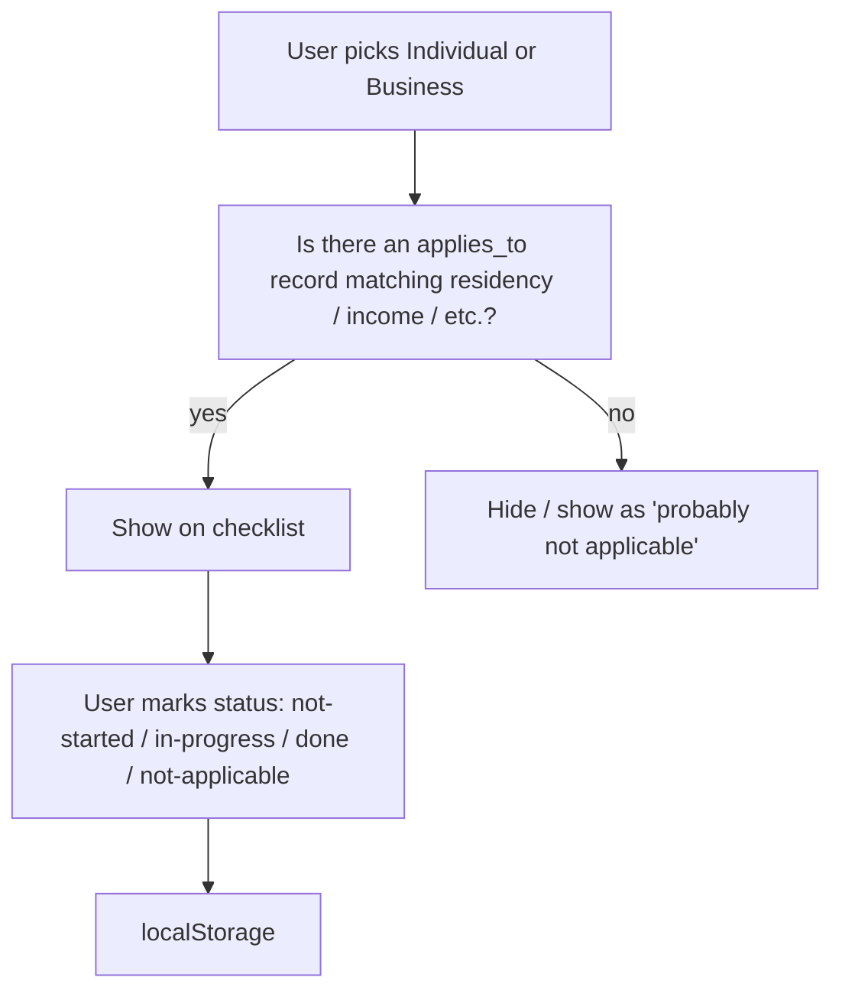

# Data Model

The site has no database. "Data" here means the **structured content files** that drive every page, plus the small amount of state we keep in the user's browser.

## Tax record schema

Every tax in scope gets one YAML file under `content/taxes/<view>/<slug>.yml`, where `<view>` is `individual`, `business`, or `reference`.

### Required fields

```yaml
# Identity
id: arts-tax                         # stable slug, used in URLs
name: Portland Arts Tax              # display name
short_name: Arts Tax                 # for breadcrumbs, lists
jurisdiction: city-of-portland       # one of: city-of-portland | multnomah-county | metro | other
view: individual                     # individual | business | reference
scope: separate-return               # separate-return | included-elsewhere | informational

# Status
last_verified: 2026-04-26            # ISO date; surfaced in UI
verified_by: bjamba                  # GitHub username of last verifier
status: active                       # active | retired | upcoming

# What is it
summary: |                           # one-paragraph plain-language summary
  A flat $35 annual tax for Portland residents...
description_md: ./descriptions/arts-tax.md    # optional longer prose, in Markdown

# Who owes it
applies_to:
  - residency: portland
    age_min: 18
    income_min_usd: 1000
    above_federal_poverty_level: true
exemptions:
  - name: Permanent Low-Income Exemption
    form: ARTS PFE
    notes: Available if household income at or below the federal poverty level.

# How much
rate:
  type: flat                         # flat | percent | progressive
  amount_usd: 35                     # for flat
  # for percent / progressive, see schema variants below

# When
tax_year: 2025                       # the tax year this record describes
deadline:
  filing: 2026-04-15
  payment: 2026-04-15
late_penalties:
  - after: 2026-04-16
    amount_usd: 15
  - after: 2026-10-16
    additional_usd: 20

# Where to file
filing:
  primary_url: https://www.portland.gov/revenue/pay-arts-tax
  administered_by: portland-revenue-division
  account_required: true
  account_url: https://pro.portland.gov/
  pin_letter_required: false        # explicit: do you need a paper letter to set up?
contact:
  phone: "503-823-5157"
  email: revenue@portlandoregon.gov
  translation_phone: "503-823-5157"

# Free filing resources
free_filing_resources:
  - name: Direct file via Portland Revenue Online
    url: https://pro.portland.gov/
    notes: No third-party software required.

# Calculator (optional — only if a calculator exists)
calculator:
  enabled: true
  type: flat-with-eligibility       # see BUSINESS_LOGIC.md for types

# Sources
sources:
  - title: Arts Tax Filing and Payment Information
    url: https://www.portland.gov/revenue/arts-tax
    accessed: 2026-04-26
```

### Rate schema variants

```yaml
# Flat
rate:
  type: flat
  amount_usd: 35

# Single-rate percent
rate:
  type: percent
  rate_pct: 1.0
  applies_to_income_above_usd: 128000   # threshold (single)
  applies_to_joint_income_above_usd: 205000

# Progressive (PFA-style)
rate:
  type: progressive
  brackets:
    - rate_pct: 1.5
      single_min_usd: 125000
      joint_min_usd: 200000
    - rate_pct: 3.0   # cumulative effective rate above this band
      single_min_usd: 250000
      joint_min_usd: 400000

# Net-income (business)
rate:
  type: net-income-percent
  rate_pct: 2.0
  gross_receipts_min_usd: 0
  notes: "Net business income."
```

## Cross-cutting reference data

Files in `content/reference/`:

- `jurisdictions.yml` — names, contact info, official websites, languages they support
- `languages.yml` — language codes, display names, RTL flag, official-jurisdiction support per language
- `tax-years.yml` — current tax year, key dates, inflation indices

These are referenced by the per-tax files via the `jurisdiction` field, etc.

## Validation

A schema (likely **Astro Content Collections** with a Zod schema, or JSON Schema if we go a different route) enforces:

- All required fields present
- Dates are real ISO dates
- URLs are reachable (link checker, runs in CI)
- `jurisdiction` and `view` use known enum values
- `last_verified` is within the last 12 months at build time (warn, not fail)

A failing validation should **fail the build**, not silently ship bad data.

## In-browser state (no server)

Stored in `localStorage` only. Never transmitted.

```ts
// Checklist
{
  "pdx-taxes:checklist:v1": {
    "tax-year": 2025,
    "view": "individual",
    "items": {
      "arts-tax": { "status": "done", "completed_at": "2026-03-12T..." },
      "multnomah-pfa": { "status": "in-progress" },
      "metro-shs": { "status": "not-applicable" }
    }
  }
}

// Language preference (also in URL — localStorage is fallback)
{
  "pdx-taxes:lang:v1": "es"
}

// Unified profile (survey + calculator inputs merged in v0.3)
// Shipped shape (v0.5+):
{
  "pdx-taxes:profile:v2": {
    "filing": "single" | "joint",
    "income": <number | null>,    // null = not provided
    "showAll": <boolean>          // toggled by view-toggle
  }
}
```

**Migration history:**
- `pdx-taxes:calc:<tax-id>:v1` — separate per-calculator keys originally planned (this section). Never shipped; consolidated into `pdx-taxes:profile:v2` before launch.
- `pdx-taxes:profile:v1` (income buckets, residency field, artsExempt boolean) — superseded by v2. Old v1 keys are silently ignored on read; users see the welcome card again. Acceptable tradeoff for a zero-data-collection site.

State design rules:
- **Versioned keys** (`:v1`, `:v2`) so we can migrate without losing data.
- **Schema-validate on read** — corrupt or wrong-shape data is dropped, not crashed on.
- **Always show a "Clear my saved data" button** in the UI (privacy hygiene).
- **No PII fields** — no name, no SSN, no household identifiers. Income is a number the user types; it never leaves the device.

## Sample applicability logic flow



## Out of scope (explicitly)

- Storing user income figures, SSNs, EINs, addresses
- Filing taxes on the user's behalf
- Calling tax-authority APIs
- Receiving forms or documents
- Any account / login system
